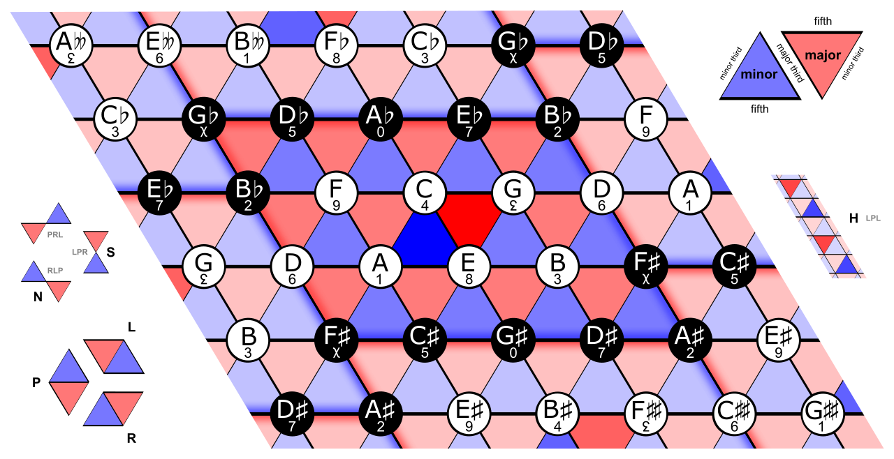

# Improvisational Bot using a Tonnetz

> Note: this is still a work in progress. It may contain bugs as I haven't ensured it to work on every machine. I'm also still learning the JUCE framework so my audio buffer assignment may be wrong.
> We aren't building this the traditional JUCE way because I didn't want to download Xcode. (kinda sucks)

Leonard Euler found a way of visualizing notes on a 2d mesh. In the figure below, the triangles are your minor/major triads. Prisms form our maj7 and min7. Truss-bridge shapes form scales and modes. [Read More](https://jazz-library.com/articles/tonnetz/)



If you look closely, you'll realize that chords connected to other chords will contain common tones. With our basic PLR operations, we can create another chord with two common tones. Basically, when we flip triangles, we'll get another triangle sharing two points. You'll also realize that this looks oddly like a vector-space. This means classical walk, perlin-noise walk, gaussian random walks, etc will apply here.

I thought that this would be a wonderful opportunity to explore atonality and indeterminancy (having read John Cage's *Silence: Lectures and Writings*).

### Getting Started

Until I find a workaround, you'll have to change the `getLogPath` under `src/tonnetz.cpp` to a path on your machine.
Otherwise, it'll use a the home directory on Mac/Unix.

Then use:
```
mkdir build
cd build
cmake -DCMAKE_BUILD_TYPE=Release ..
make
```

The resulting build release should be under `/build/src/ImprovTonnetz_artefacts/Release`

---
In order to change the type of random walk, change the method under `getNextAudioBlock()` of `synth.h`.
| Type of random walk | Description |
| ----------- | ----------- |
| `classicalNoteWalk` | A classical walk over the tonnetz. No real sense of music |
| `perlinNoteWalk` | A perlin walk over the tonnetz.  |
| `classicalChordWalk` |  |
